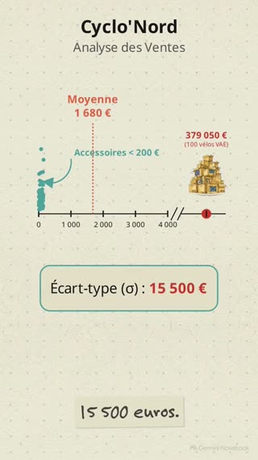

# 00 — Les maths à la main : moyenne, médiane, écart-type…

> 🧮 **À quoi sert ce cours ?** Google Sheets calcule tout pour toi. Mais pour savoir **si un chiffre
> a du sens**, il faut comprendre ce que la machine a fait. Ici, on refait chaque calcul **à la main,
> sur 7 nombres**, avant de le confier au tableur. Garde cette page ouverte pendant les deux semaines.

| | |
|---|---|
| **Quand** | **Partie 1** (sections 1 à 4) le lundi · **Partie 2** (sections 5 à 7) le mardi ; la section 7 sert surtout au brief B02-T |
| **Durée** | 30 min de lecture, 30 min d'exercices |
| **Ce qu'il faut savoir faire** | Partie 1 : les quatre opérations. Partie 2 : en plus, un carré et une racine carrée (la calculatrice les fait) |

## Les 5 idées à retenir

1. **Une ligne = une chose observée** (une commande), **une colonne = une information** sur elle (le montant).
2. **La moyenne peut ne ressembler à aucune valeur réelle** : une seule très grosse valeur la tire vers le haut.
3. **La médiane**, la valeur du milieu, **résiste** à ces très grosses valeurs.
4. **Un chiffre seul ne suffit pas** : il faut aussi dire si les valeurs sont **serrées ou dispersées**.
5. **Un chiffre sans son périmètre ne veut rien dire** : toujours préciser *sur combien de lignes, lesquelles*.

Tu n'as pas besoin de retenir les formules mathématiques. Ce qui compte : savoir dire **ce que
représente un résultat**, et si on peut s'en servir pour décider.

---

# Partie 1 — L'indispensable

## 1. Une question, et un tableau

Voici 7 commandes d'un magasin de vélos. *(Extrait inventé, avec les mêmes colonnes que le fichier
`Ventes_2025` que tu ouvriras tout à l'heure.)*

| ID_commande | Magasin | Categorie | Montant_TTC |
|---|---|---|---|
| CMD-001 | Lille | Accessoires | 12 € |
| CMD-002 | Lens | Pièces | 19 € |
| CMD-003 | Lille | Accessoires | 25 € |
| CMD-004 | Arras | Atelier | 40 € |
| CMD-005 | Lille | Accessoires | 55 € |
| CMD-006 | Amiens | Atelier | 90 € |
| CMD-007 | Lille | Vélo urbain | 600 € |

> ❓ **La question du jour** : si on doit résumer ces 7 commandes par **un seul chiffre**, lequel
> choisir ? « Une commande, c'est en gros combien ? »

Avant de répondre, les mots qu'on va utiliser :

| Mot | Sens | Dans le tableau ci-dessus |
|---|---|---|
| **Individu** | ce qu'on observe : **une ligne** | une commande, par exemple CMD-004 |
| **Variable** | une information sur chaque individu : **une colonne** | `Magasin`, `Montant_TTC` |
| **Valeur** | le contenu **d'une case** | 40 € |
| **Effectif** (`n`) | le **nombre de lignes** | 7 (613 dans le vrai fichier) |
| **Valeur extrême** | une valeur **très éloignée de la plupart des autres** | 600 € |
| **Distribution** | la façon dont les valeurs se répartissent | beaucoup de petites commandes, une très grosse |

Pour les calculs, on n'utilise que la colonne `Montant_TTC`, rangée de la plus petite à la plus grande :

```
12 €   19 €   25 €   40 €   55 €   90 €   600 €
```

---

## 2. La moyenne

**On additionne tout, puis on divise par le nombre de valeurs.**

```
12 + 19 + 25 + 40 + 55 + 90 + 600 = 841
841 ÷ 7 = 120,14 €
```

Dans Sheets : `=AVERAGE(plage)` *(en français : MOYENNE)*.
*Traduction : « j'additionne tout, et je partage à parts égales ».*

> ⚠️ **120 € ne ressemble à aucune des 7 commandes** : six font moins de 100 €, une fait 600 €.
> Personne n'a dépensé 120 €. C'est la commande de 600 € qui tire la moyenne vers le haut. Sans
> elle, la moyenne des six autres tombe à **40,17 €**.

Même chose avec trois salaires : 1 500 €, 1 600 € et 9 000 €. Moyenne : 4 033 €. Aucune des trois
personnes ne gagne « à peu près » 4 033 €.

---

## 3. La médiane (et le mode)

**La médiane** : on range les valeurs dans l'ordre, et on prend **celle du milieu**. Imagine les 7
clients alignés du plus petit au plus gros panier : la médiane, c'est la personne **au centre** de la file.

```
12   19   25  [40]  55   90   600
 ←  3 en dessous    3 au-dessus  →
```

- **Nombre impair** de valeurs (ici 7) : la valeur du milieu est la 4ᵉ → **40 €**.
- **Nombre pair** : il y a **deux** personnes au centre ; on prend la moyenne des deux. Sans la
  commande de 600 €, il reste 6 valeurs, les deux du milieu sont 25 et 40 → (25 + 40) ÷ 2 = **32,50 €**.

Dans Sheets : `=MEDIAN(plage)` *(MEDIANE)*.
*Traduction : « la moitié des valeurs est en dessous, la moitié au-dessus ».*

> 💡 La médiane de nos 7 commandes (40 €) ne bouge pas si la plus grosse vaut 600 € ou 600 000 € :
> on dit qu'elle est **robuste**. La moyenne, elle, s'envolerait.

### Moyenne ou médiane ?

| Si… | ça veut dire… | on donne plutôt… |
|---|---|---|
| moyenne ≈ médiane | pas de valeur extrême qui tire d'un côté | la moyenne, ou les deux |
| moyenne **nettement plus grande** que la médiane | **quelques très grosses valeurs** tirent la moyenne vers le haut | **la médiane** |
| moyenne **nettement plus petite** que la médiane | **quelques très petites valeurs** tirent la moyenne vers le bas | **la médiane** |

Nos 7 commandes : moyenne 120 € et médiane 40 € → une grosse commande tire la moyenne → on donne la médiane.

> 📚 **Le mot savant**, que tu croiseras dans les cours suivants : quand quelques très grosses valeurs
> tirent la moyenne vers le haut, on dit que la distribution est **étalée à droite** (la « queue » des
> grosses valeurs part vers la droite du graphique). L'inverse : **étalée à gauche**. Sans valeur
> extrême : **symétrique**.

> 🎬 **Vidéo — La médiane robuste** (7 min).
> **Avant de regarder** : sur les 613 vraies commandes de Cyclo'Nord, la moyenne vaut 1 680 €. À ton
> avis, la médiane est-elle plus grande ou plus petite ?
>
> [](videos/la-mediane-robuste.mp4)
>
> **Après** : que devient la médiane quand on retire la commande de 379 050 € ? Pourquoi ?
>
> *Dans la vidéo, on « trie » le fichier pour trouver la plus grosse commande. Dans ce module, on ne
> trie jamais `Ventes_2025` : on utilise `=LARGE(Montant; 1)` ou `FILTER` (cours 02).*

**Le mode** *(notion secondaire)* : la valeur **la plus fréquente**. Il sert surtout pour les
**catégories** : dans le tableau de la section 1, le magasin le plus fréquent est **Lille** (4
commandes sur 7). Sur des montants, il est rarement utile : nos 7 montants sont tous différents, il
n'y a pas de mode.

Dans Sheets : `=MODE(plage)` pour des nombres.

---

## 4. Parts et évolutions en pourcentage

**Une part** : `partie ÷ total`. 360 commandes livrées sur 613 → 360 ÷ 613 = 0,587 = **58,7 %**.
*Traduction : « sur 100 commandes, environ 59 sont livrées ».*

**Une évolution** : `(nouvelle valeur − ancienne) ÷ ancienne`. Le chiffre d'affaires livré de
Cyclo'Nord passe de 17 145 € en mai à 37 250 € en novembre :
(37 250 − 17 145) ÷ 17 145 = **+117 %** (il a plus que doublé).
*Traduction : « de combien j'ai bougé, par rapport à mon point de départ ».*

> ⚠️ **Points ou pourcentage ?** Un taux qui passe de 16 % à 19 % augmente de **3 points**, pas
> de 3 %. En pourcentage, c'est (19 − 16) ÷ 16 = +19 %. Dès qu'on compare **deux pourcentages**,
> on parle en **points**.

---

# Partie 2 — Approfondir (mardi)

## 5. L'étendue et les quartiles

**L'étendue** : la plus grande valeur moins la plus petite. `600 − 12 = 588 €`. Elle ne regarde
que deux valeurs, donc une seule valeur extrême la fausse.

**Les quartiles** : on reprend la file des clients rangés du plus petit au plus gros panier, et on
la coupe en **quatre groupes de même taille**. Avec 100 clients : 25 dans chaque groupe.

```
[ 25 % des clients ] Q1 [ 25 % ] Q2 = médiane [ 25 % ] Q3 [ 25 % des clients ]
```

| Repère | Sens | Nos 7 commandes (calcul Sheets) |
|---|---|---|
| **Q1** | un quart des valeurs en dessous | **22 €** |
| **Q2** = médiane | la moitié en dessous | **40 €** |
| **Q3** | trois quarts en dessous | **72,50 €** |

La phrase à savoir dire : **« la moitié des commandes est entre Q1 et Q3 »**, ici entre 22 € et
72,50 €. L'écart **Q3 − Q1** (50,50 €) s'appelle l'**écart interquartile**.

Dans Sheets : `=QUARTILE(plage; 1)` et `=QUARTILE(plage; 3)`.

<details>
<summary>🔎 Pour plus tard : pourquoi 22 € alors que 22 n'est pas dans la liste ?</summary>

Avec 7 valeurs, on ne peut pas faire quatre groupes exactement égaux : Q1 tombe « entre » la
2ᵉ valeur (19) et la 3ᵉ (25). Sheets prend alors un point intermédiaire : 19 + (25 − 19) ÷ 2 = 22.
Il existe d'autres façons de faire, qui donnent des résultats un peu différents (au lycée, on prend
souvent la 2ᵉ valeur, 19). Ce n'est pas une erreur : c'est une **convention**. Avec des centaines
de lignes, les écarts entre conventions deviennent minuscules. Dans ce module, on utilise toujours
celle de Sheets.

</details>

---

## 6. L'écart-type

### D'abord, voir

Deux séries, **même moyenne (5)**, **même médiane (5)** :

```
Série A :   4   5   5   6        → les valeurs sont serrées autour de 5
Série B :   1   5   5   9        → les valeurs sont loin de 5
```

La moyenne ne voit pas la différence. Il faut un deuxième chiffre qui dise **à quel point les
valeurs s'éloignent de la moyenne** : c'est l'**écart-type**. Sheets donne **0,82** pour A et
**3,27** pour B.

*Traduction : « en général, les valeurs sont à environ tant de la moyenne ».*

### Ensuite, calculer (une fois, pour comprendre)

Série : `2, 4, 4, 4, 5, 5, 7, 9` (8 valeurs, moyenne **5**).

| Valeur | Écart à la moyenne (valeur − 5) | Écart au carré |
|---|---|---|
| 2 | −3 | 9 |
| 4 | −1 | 1 |
| 4 | −1 | 1 |
| 4 | −1 | 1 |
| 5 | 0 | 0 |
| 5 | 0 | 0 |
| 7 | 2 | 4 |
| 9 | 4 | 16 |
| | **somme** | **32** |

1. **On mesure l'écart** de chaque valeur à la moyenne.
2. **On met au carré** : sinon les écarts négatifs et positifs s'annuleraient (leur somme fait 0).
3. **On fait la moyenne des carrés** : 32 ÷ 8 = **4**. C'est la **variance**.
4. **On prend la racine carrée** pour revenir dans l'unité de départ (des euros, par exemple) : √4 = **2**. C'est l'**écart-type**.

> ✅ **Lecture** : en général, les valeurs sont à **environ 2** de la moyenne 5.

<details>
<summary>🔎 Pour plus tard : pourquoi Sheets donne 2,14 et pas 2 ?</summary>

Quand les données ne sont qu'une **partie** de ce qu'on veut décrire (un **échantillon**), on divise
par **n − 1** au lieu de n : 32 ÷ 7 = 4,57, puis √4,57 = **2,14**. C'est ce que fait `=STDEV(plage)`
*(ECARTYPE)*, celui qu'on utilise dans le module. Avec beaucoup de lignes (613 commandes), les deux
calculs donnent presque le même résultat.

</details>

| Écart-type… | veut dire… |
|---|---|
| petit par rapport à la moyenne | les valeurs sont regroupées : la moyenne les résume bien |
| grand par rapport à la moyenne | les valeurs sont très dispersées : la moyenne résume mal |

Cyclo'Nord : moyenne 1 680 €, écart-type 15 505 € → neuf fois la moyenne : très dispersé.

> 🎬 **Vidéo — L'écart-type : quand la moyenne vous ment** (1 min).
> **Avant de regarder** : un écart-type neuf fois plus grand que la moyenne, qu'est-ce que ça dit
> de la moyenne ?
>
> [](videos/ecart-type-quand-la-moyenne-ment.mp4)
>
> *Une nuance : la vidéo dit que « l'écrasante majorité » des commandes fait moins de 200 €. En
> réalité, c'est **la moitié** (314 sur 613), ce que dit la médiane de 177 €.*

---

## 7. La moyenne pondérée

Parfois, **certains nombres comptent plus que d'autres**. Le « poids » (ou coefficient) dit combien
de fois chaque nombre compte.

**Exemple du bac** : 12 en maths (coefficient 2), 15 en français (coefficient 4), 10 en sport
(coefficient 1). Le français compte **4 fois**, comme si on avait eu 15, 15, 15 et 15.

```
Moyenne simple   : (12 + 15 + 10) ÷ 3                   = 12,33
Moyenne pondérée : (12×2 + 15×4 + 10×1) ÷ (2 + 4 + 1)   = 94 ÷ 7 = 13,43
```

Le français pèse plus lourd : la moyenne pondérée se rapproche de 15.

Dans Sheets : `=SUMPRODUCT(valeurs; poids) / SUM(poids)` *(SOMMEPROD)*.
*Traduction : « chaque valeur compte autant de fois que son poids ».*
Pour des territoires, le poids est souvent la **population** : chaque habitant compte pour une voix
(brief B02-T).

---

## Exercices (30 min)

> Fais-les **avant** d'ouvrir les réponses. Série : `3, 5, 5, 6, 8, 9, 20` (7 valeurs).

**Série 1 — Calculer**

1. Calcule la moyenne.
2. Donne la médiane et le mode.
3. Quelle est l'étendue ?

**Série 2 — Interpréter**

4. Moyenne ou médiane : laquelle résume le mieux cette série, et pourquoi ?
5. Retire le 20 : que deviennent la moyenne et la médiane ?

**Série 3 — Cas métier**

6. Un magasin passe de 40 à 50 commandes par jour. Quelle évolution en % ?
7. Deux classes : 10 élèves avec 12 de moyenne, 30 élèves avec 8. Quelle est la moyenne de tous
   les élèves ? (Attention : ce n'est pas 10.)

<details>
<summary>Réponses</summary>

1. (3 + 5 + 5 + 6 + 8 + 9 + 20) ÷ 7 = 56 ÷ 7 = **8**.
2. Médiane : la 4ᵉ valeur, **6**. Mode : **5** (deux fois).
3. 20 − 3 = **17**.
4. **La médiane** : la moyenne (8) est tirée vers le haut par le 20 ; six valeurs sur sept sont en dessous de 10.
5. Reste `3, 5, 5, 6, 8, 9` : moyenne 36 ÷ 6 = **6** ; médiane (5 + 6) ÷ 2 = **5,5**. La moyenne perd 2, la médiane seulement 0,5.
6. (50 − 40) ÷ 40 = **+25 %**.
7. Moyenne pondérée par le nombre d'élèves : (10 × 12 + 30 × 8) ÷ 40 = 360 ÷ 40 = **9**. La moyenne simple des deux classes (10) donnerait autant de poids à 10 élèves qu'à 30.

</details>

---

## En une image

![Infographie de synthèse du module : la médiane est plus robuste que la moyenne face aux valeurs extrêmes ; l'écart-type mesure la dispersion autour de la moyenne ; distribution symétrique (moyenne = médiane), étalée à droite (moyenne > médiane) ou à gauche (moyenne < médiane) ; toujours préciser le périmètre et l'effectif ; le TCD regroupe pour calculer ; un graphique = une intention (barres pour comparer, courbes pour l'évolution, histogrammes pour la distribution) ; éviter la 3D, les axes tronqués et les camemberts à plus de 3 parts](images/synthese-analyse-de-donnees.jpg)

*Dans l'encadré rouge, le diagramme en barres du milieu est aussi un mauvais exemple : ses
graduations (100, 175, 110, 105) ne sont pas dans l'ordre.*

---

## Mémo : je calcule, je comprends

| Notion | Je calcule | Je comprends | Dans Sheets |
|---|---|---|---|
| Moyenne | somme ÷ nombre | le partage à parts égales ; **sensible** aux valeurs extrêmes | `AVERAGE` |
| Médiane | valeur du milieu (rangées) | la valeur « habituelle » ; **résiste** aux valeurs extrêmes | `MEDIAN` |
| Mode | valeur la plus fréquente | surtout utile pour des catégories | `MODE` |
| Part | partie ÷ total | combien sur 100 | `=B2/B3` |
| Évolution | (nouveau − ancien) ÷ ancien | de combien j'ai bougé, par rapport au départ | `=(B2-A2)/A2` |
| Étendue | max − min | l'écart entre les deux extrêmes | `MAX(…) - MIN(…)` |
| Quartiles | coupent en 4 groupes égaux | la moitié des valeurs est entre Q1 et Q3 | `QUARTILE(…; 1)`, `QUARTILE(…; 3)` |
| Écart-type | racine de la moyenne des écarts au carré | les valeurs sont-elles serrées ou dispersées ? | `STDEV` |
| Moyenne pondérée | Σ(valeur × poids) ÷ Σ poids | chaque valeur compte autant de fois que son poids | `SUMPRODUCT(…; …) / SUM(…)` |

<details>
<summary>📐 Pour aller plus loin : l'écriture mathématique</summary>

Tu croiseras ces notations dans des livres ou des articles. Elles disent exactement la même chose
que le mémo.

- La moyenne se note **x̄** (« x barre ») : $\bar{x} = \frac{x_1 + x_2 + \dots + x_n}{n} = \frac{\sum x_i}{n}$
- Le signe **Σ** (sigma) veut dire « additionne tout ».
- La moyenne pondérée : $\frac{\sum (valeur_i \times poids_i)}{\sum poids_i}$

</details>

➡️ Retour à la [feuille de route du module](README.md) · cours suivant : [01 — Position](01-statistiques-descriptives.md)
