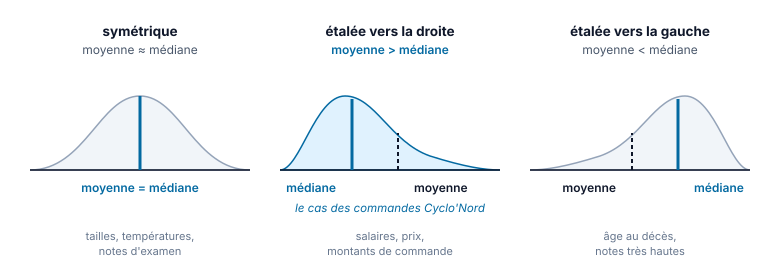

# 01 — Statistiques descriptives : moyenne, médiane, mode

> 🎬 **Le fil rouge de la semaine — Cyclo'Nord.**
> La semaine dernière, tu as **audité** l'export de commandes de Cyclo'Nord : doublons, villes mal
> orthographiées, montants faux, dates de 2015. Tu as rendu un rapport. La direction a corrigé.
> Ce lundi matin, la responsable commerciale, Nadia Oumejjoud, revient avec le fichier propre et une
> question simple : **« Bon. Maintenant, dites-moi ce qu'il y a dedans. »**
> Elle veut un chiffre. Un seul. « Notre commande moyenne, c'est combien ? »
> Tu vas lui en donner un — puis lui expliquer pourquoi il ne veut presque rien dire.

| | |
|---|---|
| **Jour** | Lundi 21/09/2026 · matin (apport) + après-midi (exercice) |
| **Durée** | ≈ 7 h |
| **Compétences** | **C3.1** (niveau 1) · **C4.5** (niveau 1) |
| **Outils** | Excel (LibreOffice Calc / Google Sheets acceptés) |
| **Données** | [`donnees/cyclonord_ventes_2025_fiable.xlsx`](donnees/cyclonord_ventes_2025_fiable.xlsx) |
| **Pré-requis** | Semaine P1 : trier, filtrer, tableau structuré |

---

## Objectifs pédagogiques

À la fin de la journée, tu sauras :

1. Distinguer une variable **quantitative** d'une variable **qualitative**, et savoir quels calculs
   chacune autorise.
2. Calculer une **moyenne**, une **médiane** et un **mode** avec les fonctions du tableur.
3. Expliquer ce que chacun de ces trois indicateurs **dit** — et ce qu'il **cache**.
4. Lire l'écart entre moyenne et médiane comme une information sur la **forme** de la distribution.
5. Calculer un indicateur **sur un sous-ensemble** (`MOYENNE.SI.ENS`) et une **moyenne pondérée**.
6. Écrire une phrase de restitution qui ne ment pas.

---

## 1. Pourquoi un Data Analyst commence toujours par là

Personne ne lit 613 lignes. Encore moins 31 000. Le premier travail d'un analyste, c'est de
**résumer** : remplacer un tableau par quelques nombres qui en disent l'essentiel.

Ce résumé s'appelle la **statistique descriptive**. Elle répond à trois questions, dans cet ordre :

| Question | Famille d'indicateurs | Vu quand |
|---|---|---|
| « Ça vaut combien, **en gros** ? » | **Position** (moyenne, médiane, mode) | aujourd'hui |
| « Est-ce que ça **varie** beaucoup ? » | **Dispersion** (écart-type, quartiles, étendue) | [demain](02-dispersion-et-pieges-de-la-moyenne.md) |
| « Est-ce que ça **dépend** d'autre chose ? » | **Croisements** (TCD) | [mercredi](03-tableaux-croises-dynamiques.md) |

> ⚠️ **La faute n°1 en entreprise** : s'arrêter à la première question. Un chiffre de position seul
> est presque toujours trompeur. On ne le publie jamais sans un chiffre de dispersion à côté.

---

## 2. Avant de calculer : de quel type est ma colonne ?

Tu ne peux pas faire la moyenne de « Lille ». Ça paraît évident — et pourtant c'est la source de la
moitié des erreurs. Classe tes colonnes **avant** d'ouvrir la boîte à formules.

| Type | Définition | Dans Cyclo'Nord | Ce qu'on peut calculer |
|---|---|---|---|
| **Quantitative continue** | un nombre mesurable, les décimales ont un sens | `Montant_TTC`, `Prix_unitaire_TTC`, `Remise` | moyenne, médiane, mode, écart-type, somme |
| **Quantitative discrète** | un nombre qui se compte, entier | `Quantite` | idem (mais « 1,78 vélo » se commente) |
| **Qualitative nominale** | une étiquette, sans ordre | `Magasin`, `Departement`, `Categorie`, `Produit`, `Canal`, `Statut` | **effectifs**, pourcentages, **mode** |
| **Qualitative ordinale** | une étiquette **ordonnée** | `Note_client` (1 à 5) | effectifs, mode, **médiane** — moyenne discutable |
| **Date** | un point dans le temps | `Date_commande` | min, max, étendue, regroupements |
| **Identifiant** | sert à désigner, pas à mesurer | `ID_commande` | **rien** — on compte, c'est tout |

> 🧠 **Le test qui tranche.** Pose-toi la question : *« la somme de cette colonne a-t-elle un sens ? »*
> Somme des montants = chiffre d'affaires ✅. Somme des `ID_commande` = rien du tout ❌.
> Si la somme n'a pas de sens, la moyenne non plus.

### Le cas piégeux : `Note_client`

Une note de 1 à 5 est **ordinale**. On sait que 5 > 4, mais rien ne dit que l'écart entre 4 et 5
vaut l'écart entre 1 et 2. Faire la moyenne revient à supposer que si. Tout le monde le fait
(y compris Amazon), mais un analyste doit savoir qu'il prend une liberté — et donner **aussi** la
répartition des notes.

---

## 3. Les trois indicateurs de position

### Avant la première formule : créer le tableau `T_Ventes`

Toutes les formules de ce cours écrivent `T_Ventes[Montant_TTC]` au lieu de `K2:K614`. Ce nom
n'existe pas encore dans le fichier : c'est à toi de le créer, **une seule fois**, sur l'onglet
`Ventes_2025`. Sans lui, chaque formule renvoie l'erreur `#NOM?` (`#NAME?` dans Google Sheets).

| Étape | Excel sur ordinateur | Excel en ligne | Google Sheets |
|---|---|---|---|
| **0. Préparer** | — | Ouvre le fichier depuis OneDrive. Si le menu *Insertion* est grisé, clique sur **Modifier** | Si un badge **.XLSX** s'affiche à côté du nom du fichier, fais d'abord *Fichier › Enregistrer au format Google Sheets* |
| **1. Convertir** | Clique dans les données, puis `Ctrl + L` (`⌘ + T` sur Mac) ou *Insertion › Tableau* | Clique dans les données, puis *Insertion › Tableau* (le raccourci `Ctrl + L` peut être capté par le navigateur) | Sélectionne les données, puis *Format › Convertir en tableau* (`Ctrl + Alt + T`, `⌘ + Option + T` sur Mac) |
| **2. Valider** | Vérifie la plage `$A$1:$M$614`, coche **« Mon tableau comporte des en-têtes »**, puis **OK** | Pareil | Contrôle le type proposé pour chaque colonne |
| **3. Nommer** | Onglet *Création de tableau* (*Tableau* sur Mac) › **Nom du tableau** : remplace `Tableau1` par `T_Ventes`, puis `Entrée` | Onglet *Création de tableau* › **Nom du tableau** : pareil | Menu **Tableau**, à côté du nom affiché au-dessus du tableau › **Renommer le tableau** › `T_Ventes` |

**Vérifie** dans une cellule vide :

```excel
=LIGNES(T_Ventes)          → 613                [ROWS]
```

Tu obtiens 613 et non 614 : `T_Ventes` désigne **les données, sans la ligne d'en-tête**, dans Excel
comme dans Google Sheets.

> ⚠️ **Nom refusé ?** Dans Excel, un nom de tableau commence par une lettre et ne contient ni espace
> ni tiret : `T Ventes` et `T-Ventes` sont refusés. Google Sheets accepte l'espace mais le remplace par
> `_` dans les formules. Tape directement `T_Ventes` partout, et le nom sera le même dans les deux outils.

### 3.1 La moyenne (arithmétique)

La somme des valeurs divisée par leur nombre. C'est le **point d'équilibre** de la distribution :
pose tes valeurs sur une règle, la moyenne est l'endroit où la règle tient en équilibre.

```excel
=MOYENNE(T_Ventes[Montant_TTC])          → 1 679,77 €
```

> 🇬🇧 En anglais : `AVERAGE`. Chaque formule de ce cours est donnée en français ; l'équivalent
> anglais est indiqué la première fois.

**Ce qu'il faut savoir sur `MOYENNE` :**

- Elle **ignore les cellules vides** — elle ne les compte pas comme des zéros. Sur `Note_client`,
  les 53 commandes sans note sont simplement exclues du calcul : `MOYENNE` porte sur 560 notes.
- Elle **ignore le texte**. Une cellule contenant `N/A` saisi à la main n'est pas comptée.
- Elle est **sensible aux valeurs extrêmes**. Une seule valeur énorme la déplace beaucoup.

> 🎯 **Vérifie toujours combien de valeurs ont réellement servi au calcul.**
> ```excel
> =NB(T_Ventes[Note_client])          → 560   (valeurs numériques)      [COUNT]
> =NBVAL(T_Ventes[Note_client])       → 560   (cellules non vides)      [COUNTA]
> =NB.VIDE(T_Ventes[Note_client])     →  53   (cellules vides)          [COUNTBLANK]
> ```
> Une moyenne calculée sur 560 lignes annoncée comme « la note moyenne de nos 613 commandes » est
> déjà une petite malhonnêteté.

### 3.2 La médiane

Range toutes les valeurs par ordre croissant, prends celle du **milieu** : la moitié des commandes
est en dessous, la moitié au-dessus.

```excel
=MEDIANE(T_Ventes[Montant_TTC])          → 177,00 €        [MEDIAN]
```

La médiane se moque de l'ampleur des extrêmes. Que la plus grosse commande fasse 8 000 € ou
380 000 €, la commande du milieu reste la même. On dit qu'elle est **robuste**.

### 3.3 Le mode

La valeur la **plus fréquente**. C'est le seul indicateur de position qui marche aussi sur du texte.

```excel
=MODE.SIMPLE(T_Ventes[Montant_TTC])      → 19,00 €         [MODE.SNGL]
```

**Sur du texte**, `MODE.SIMPLE` ne suffit plus : elle ignore le texte et renvoie une erreur. Pour
obtenir directement le mode d'une colonne texte, on combine trois fonctions :

```excel
=MODE.SIMPLE(T_Ventes[Canal])            → #N/A            ← MODE ne lit que des nombres
=INDEX(T_Ventes[Canal];MODE.SIMPLE(EQUIV(T_Ventes[Canal];T_Ventes[Canal];0)))
                                         → Magasin         [INDEX, MATCH]
```

Lis la formule de l'intérieur vers l'extérieur :

1. `EQUIV(T_Ventes[Canal];T_Ventes[Canal];0)` remplace chaque canal par un **nombre** : la position
   de sa première apparition dans la colonne. Toutes les lignes « Magasin » reçoivent le même numéro.
2. `MODE.SIMPLE(...)` travaille enfin sur des nombres : elle trouve le numéro le plus fréquent.
3. `INDEX(T_Ventes[Canal];...)` retraduit ce numéro en texte : `Magasin`.

> 🧰 **Valider la formule.** Dans Excel 365 et Excel en ligne, `Entrée` suffit. Dans Excel 2019 ou
> plus ancien, LibreOffice Calc et Google Sheets, valide avec `Ctrl + Maj + Entrée` : la formule
> travaille sur toute une colonne à la fois (formule matricielle).

Cette formule donne le **gagnant**, pas le **score**. En cas d'égalité, elle renvoie la valeur
rencontrée en premier, sans prévenir. Pour voir l'écart avec les autres valeurs, compte-les une à une
(ou, plus simplement, fais le TCD de mercredi) :

```excel
=NB.SI.ENS(T_Ventes[Canal];"Magasin")    → 354            [COUNTIFS]
=NB.SI.ENS(T_Ventes[Canal];"Site web")   → 179
=NB.SI.ENS(T_Ventes[Canal];"Click & Collect") → 80
```

Le mode de `Canal` est donc **« Magasin »** : c'est le canal dominant, avec 58 % des commandes.

> 💡 **Le mode est sous-estimé.** Sur les ventes Cyclo'Nord il vaut 19 € : la commande la plus
> fréquente, ce n'est ni un VAE ni un VTT, c'est **un changement de chambre à air**. Voilà une
> information que ni la moyenne ni la médiane ne donnent : le magasin vit d'un flux d'atelier à très
> petit ticket.

---

## 4. Le moment de vérité : les trois chiffres côte à côte

| Indicateur | Valeur sur `Montant_TTC` | Ce qu'il raconte |
|---|---|---|
| **Mode** | **19 €** | La commande la plus fréquente : une réparation |
| **Médiane** | **177 €** | La commande du milieu : un accessoire ou une petite prestation |
| **Moyenne** | **1 679,77 €** | Un chiffre que presque **aucune** commande réelle n'atteint |

La moyenne est **9,5 fois** plus grande que la médiane. Les trois indicateurs décrivent le même
fichier et racontent trois histoires différentes.

### Ce que l'écart moyenne / médiane t'apprend

C'est une règle de lecture que tu utiliseras toute ta carrière :

| Situation | Forme de la distribution | Exemple typique |
|---|---|---|
| moyenne ≈ médiane | **symétrique** | tailles, températures, notes d'examen |
| **moyenne > médiane** | **étalée vers la droite** — quelques valeurs très grandes | salaires, prix, montants de commande |
| moyenne < médiane | étalée vers la gauche — quelques valeurs très petites | âge au décès, notes très hautes |



> 📐 **Comment lire ces trois images.** Le trait bleu plein est la **médiane**, le trait noir
> pointillé la **moyenne**. À gauche, ils se confondent. Au centre, la traîne de droite **tire la
> moyenne** loin de la médiane : c'est le cas de Cyclo'Nord, et c'est la forme la plus fréquente
> sur des montants. Retiens le geste : **la moyenne suit la traîne, la médiane reste sur le gros
> du peloton.**

Ici : moyenne ≫ médiane → **distribution fortement étalée vers la droite**. Une poignée de très
grosses commandes (les VAE, et surtout une commande de flotte de 100 vélos cargo à 379 050 €)
tire la moyenne vers le haut pendant que la masse des commandes reste sous 200 €.

> 🚩 **La règle à retenir.**
> **Distribution asymétrique → on communique la médiane.**
> La moyenne reste utile pour une chose : multipliée par l'effectif, elle redonne le total.
> `1 679,772431 × 613 = 1 029 700,50 €` — c'est le **total commandé** sur l'année.
> ⚠️ Deux précautions. D'abord ce total **n'est pas le chiffre d'affaires** : on verra au §5
> pourquoi, et c'est un vrai piège professionnel. Ensuite il faut la moyenne **non arrondie** :
> avec 1 679,77 on retombe sur 1 029 699,01 €, soit 1,49 € d'écart. Un arrondi publié ne permet
> plus de reconstruire le total.

---

## 5. Calculer sur un sous-ensemble

Un indicateur global ne sert presque jamais tel quel. Ce qu'on veut, c'est *« la moyenne **des VAE** »*,
*« le panier médian **de Lille** »*. Deux familles de fonctions, à retenir maintenant :

```excel
=MOYENNE.SI.ENS(T_Ventes[Montant_TTC]; T_Ventes[Categorie]; "VAE")     [AVERAGEIFS]
=SOMME.SI.ENS( T_Ventes[Montant_TTC]; T_Ventes[Magasin];   "Lille")    [SUMIFS]
=NB.SI.ENS(    T_Ventes[Statut];      "Livrée")                        [COUNTIFS]
```

On peut empiler les critères — ils se cumulent avec un **ET** :

```excel
=MOYENNE.SI.ENS(T_Ventes[Montant_TTC];
                T_Ventes[Categorie]; "VAE";
                T_Ventes[Statut];    "Livrée";
                T_Ventes[Canal];     "Site web")
```

> ⚠️ **Il n'existe pas de `MEDIANE.SI.ENS`.** C'est une vraie limite du tableur, et c'est précisément
> une des raisons d'être du **TCD** de mercredi. En attendant, on passe par un filtre, ou par une
> formule matricielle (`=MEDIANE(SI(...))`, hors programme aujourd'hui).

### Le périmètre : la question qu'on oublie toujours

```excel
=SOMME(T_Ventes[Montant_TTC])                                    → 1 029 700 €
=SOMME.SI.ENS(T_Ventes[Montant_TTC]; T_Ventes[Statut]; "Livrée") →   343 877 €
```

**Deux tiers du « chiffre d'affaires » correspondent à des commandes annulées, retournées ou encore
en cours.** Aucun des deux chiffres n'est faux : ils ne répondent pas à la même question. Mais si tu
écris « CA 2025 : 1 029 700 € » sans préciser, tu trompes ton lecteur.

> 📌 **Réflexe à installer dès maintenant** : avant tout calcul, écris noir sur blanc **sur quelles
> lignes** il porte. Cette phrase ira dans ton livrable.

---

## 6. La moyenne pondérée

« Note moyenne : 4,10 » — mais toutes les commandes pèsent-elles pareil ? Une réparation à 19 € et
la flotte à 379 050 € comptent chacune pour une note. Si tu veux une note moyenne **pondérée par le
chiffre d'affaires**, tu dois donner à chaque note un poids :

$$\text{moyenne pondérée} = \frac{\sum (valeur_i \times poids_i)}{\sum poids_i}$$

En tableur, une seule fonction fait le numérateur :

```excel
=SOMMEPROD(T_Ventes[Note_client]; T_Ventes[Montant_TTC]) / SOMME(T_Ventes[Montant_TTC])
```
> `SOMMEPROD` = `SUMPRODUCT` : il multiplie les deux colonnes ligne à ligne, puis additionne.

⚠️ Cette formule suppose qu'aucune note n'est vide (une cellule vide vaut 0 dans `SOMMEPROD`, ce qui
fausse le résultat). Sur un vrai fichier, on restreint d'abord aux lignes notées.

**Quand pondérer ?** Dès qu'additionner des unités de tailles différentes n'a pas de sens :

- moyenne des prix de 8 magasins → chaque magasin compte pour 1, même celui qui fait 5 ventes ;
- **moyenne pondérée par le nombre de ventes** → chaque *vente* compte pour 1.

Tu retrouveras exactement ce piège vendredi, sur les communes : une commune de 300 habitants doit-elle
peser autant qu'une ville de 230 000 dans le « revenu moyen du territoire » ? *(Réponse : non, et
l'écart entre les deux calculs se chiffre.)*

---

## 7. Mémo des fonctions du jour

| Besoin | Excel (FR) | Excel (EN) |
|---|---|---|
| Moyenne | `MOYENNE` | `AVERAGE` |
| Médiane | `MEDIANE` | `MEDIAN` |
| Mode | `MODE.SIMPLE` | `MODE.SNGL` |
| Mode d'une colonne texte | `INDEX` + `MODE.SIMPLE` + `EQUIV` | `INDEX` + `MODE.SNGL` + `MATCH` |
| Somme | `SOMME` | `SUM` |
| Compter des nombres | `NB` | `COUNT` |
| Compter des cellules non vides | `NBVAL` | `COUNTA` |
| Compter des cellules vides | `NB.VIDE` | `COUNTBLANK` |
| Compter sous condition | `NB.SI.ENS` | `COUNTIFS` |
| Sommer sous condition | `SOMME.SI.ENS` | `SUMIFS` |
| Moyenne sous condition | `MOYENNE.SI.ENS` | `AVERAGEIFS` |
| Moyenne pondérée | `SOMMEPROD` / `SOMME` | `SUMPRODUCT` / `SUM` |
| Minimum / maximum | `MIN` / `MAX` | `MIN` / `MAX` |

> 🧰 **Pourquoi le tableau structuré ?** `T_Ventes[Montant_TTC]` se lit mieux que `K2:K614`, et la
> formule s'étend toute seule quand des lignes arrivent. Prends l'habitude dès aujourd'hui : la
> création pas à pas (Excel, Excel en ligne, Google Sheets) est au
> [début de la section 3](#avant-la-première-formule--créer-le-tableau-t_ventes).

---

## 8. À toi de jouer

➡️ **[Exercice guidé — Faire parler les ventes Cyclo'Nord](05-exercice-guide-cyclonord.md), partie A**
*(à faire cet après-midi, niveau 1 · imiter)*

---

## 9. Auto-évaluation

Coche seulement si tu sais répondre **sans relire** :

- [ ] Je sais dire, pour chaque colonne du fichier, si je peux en faire la moyenne — et pourquoi.
- [ ] Je sais que `MOYENNE` ignore les cellules vides, et je vérifie combien de valeurs ont servi.
- [ ] Je sais lire l'écart moyenne / médiane comme une information sur la forme de la distribution.
- [ ] Je sais dire pourquoi le mode de `Montant_TTC` vaut 19 € alors que la moyenne vaut 1 680 €.
- [ ] Je sais calculer une moyenne sur un sous-ensemble sans filtrer à la main.
- [ ] Je précise toujours le **périmètre** de mes calculs.
- [ ] Je sais expliquer à quoi sert une moyenne pondérée et donner un cas où elle change le résultat.

---

## 10. Pour aller plus loin

- INSEE — [définitions : moyenne, médiane, mode](https://www.insee.fr/fr/metadonnees/definitions)
- Microsoft — [fonctions statistiques Excel](https://support.microsoft.com/fr-fr/office/fonctions-statistiques-r%C3%A9f%C3%A9rence-624dac86-a375-4435-bc25-76d6df3c5b6f)
- Microsoft — [MOYENNE.SI.ENS](https://support.microsoft.com/fr-fr/office/moyenne-si-ens-fonction-moyenne-si-ens-48910c45-1fc0-4389-a028-f7c5c3001690)
- Google — [liste des fonctions Google Sheets](https://support.google.com/docs/table/25273)

➡️ **Demain : [02 — Dispersion : écart-type, quartiles et pièges de la moyenne](02-dispersion-et-pieges-de-la-moyenne.md)**
