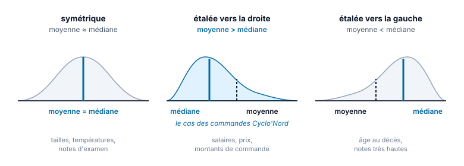

# 01 — Position : moyenne, médiane, mode

> 🎬 **Fil rouge — Cyclo'Nord.** La semaine dernière, tu as audité l'export de commandes. La
> direction a corrigé le fichier. Ce lundi, Nadia Oumejjoud, la responsable commerciale, revient
> avec une question simple : **« Notre commande moyenne, c'est combien ? »**
> Tu vas lui donner ce chiffre, puis lui expliquer pourquoi il ne suffit pas.

| Jour | Durée démo | Mise en pratique |
|---|---|---|
| Lundi (matin) | 45 min | [Exercice guidé, partie A](05-exercice-guide-cyclonord.md) (après-midi) |

Outil : **Google Sheets**. Données : [`donnees/cyclonord_ventes_2025_fiable.xlsx`](donnees/cyclonord_ventes_2025_fiable.xlsx), onglet `Ventes_2025`, 613 commandes.

---

## Ce que tu sauras faire

- Dire si une colonne permet de calculer une moyenne.
- Calculer une moyenne, une médiane et un mode, et lire l'écart entre eux.
- Compter les valeurs avant de commenter un chiffre.
- Préciser le **périmètre** d'un calcul (commandé ≠ livré).
- Calculer un indicateur par catégorie sans filtrer à la main.

---

## 0. Importer le fichier et créer les plages nommées

**Importer.** Ouvre une feuille Google Sheets vierge, puis *Fichier › Importer*. Envoie le fichier
`cyclonord_ventes_2025_fiable.xlsx` et choisis de **remplacer la feuille de calcul**. Tu retrouves
l'onglet `Ventes_2025`, avec les en-têtes en ligne 1 et les commandes de la ligne 2 à la ligne 614.

**Nommer.** Écrire `K2:K614` dans chaque formule, c'est illisible et source d'erreurs. Une **plage
nommée** est un nom que tu donnes à un groupe de cellules : tu écris ensuite `Montant` au lieu de
`Ventes_2025!K2:K614`. Menu *Données › Plages nommées*, puis ajoute une plage pour chaque ligne :

| Nom | Plage |
|---|---|
| `Montant` | `Ventes_2025!K2:K614` |
| `Note` | `Ventes_2025!M2:M614` |
| `Statut` | `Ventes_2025!L2:L614` |
| `Categorie` | `Ventes_2025!E2:E614` |
| `Magasin` | `Ventes_2025!C2:C614` |

Les plages commencent en ligne 2 : l'en-tête n'en fait pas partie. **Vérifie** dans une cellule vide :

```
=COUNTA(Montant)          → 613
```

> 🇬🇧 Sheets affiche les fonctions **en anglais**. Le nom français est donné entre parenthèses la
> première fois. Avec les paramètres régionaux France, on sépare les arguments par **`;`**.
> `COUNTA` (NBVAL) compte les cellules non vides.

---

## 1. Avant de calculer : de quel type est ma colonne ?

Tu ne peux pas faire la moyenne de « Lille ». Classe tes colonnes **avant** d'écrire une formule.

| Type | Ce que c'est | Dans Cyclo'Nord | Calculs possibles |
|---|---|---|---|
| **Quantitative** | un nombre qui se mesure ou se compte | `Montant`, `Quantite`, `Prix` | moyenne, médiane, mode, somme |
| **Qualitative** | une étiquette | `Magasin`, `Categorie`, `Canal`, `Statut` | compter, pourcentage, mode |
| **Ordinale** | une étiquette **rangée dans un ordre** | `Note` (1 à 5) | compter, mode, médiane ; moyenne avec prudence |
| **Identifiant** | un code qui désigne une ligne | `ID_commande` | compter, rien d'autre |

> 🧠 **Le test qui tranche** : *« la somme de cette colonne a-t-elle un sens ? »* La somme des
> montants donne un total ✅. La somme des identifiants ne veut rien dire ❌. Pas de somme, pas de moyenne.

Pour `Note`, 5 est mieux que 4, mais rien ne dit que l'écart entre 4 et 5 vaut celui entre 1 et 2.
Tout le monde calcule quand même une note moyenne. Toi, tu donnes **aussi** la médiane ou le mode.

---

## 2. Trois façons de dire « en gros, ça vaut combien »

Un **indicateur de position** résume une colonne de nombres par une seule valeur. Il en existe trois.

**La moyenne** : la somme des valeurs divisée par leur nombre. C'est le point d'équilibre.

```
=AVERAGE(Montant)          → 1 679,77 €        (MOYENNE)
```

**La médiane** : range les valeurs dans l'ordre et prends celle du milieu. La moitié des commandes
est en dessous, la moitié au-dessus.

```
=MEDIAN(Montant)           → 177,00 €          (MEDIANE)
```

**Le mode** : la valeur la plus fréquente.

```
=MODE(Montant)             → 19,00 €           (MODE)
```

Le mode de 19 € correspond à un produit précis : le **changement de chambre à air**, vendu 28 fois
par l'atelier. Ni la moyenne ni la médiane ne te l'auraient dit.

### Le moment de vérité : les trois côte à côte

| Indicateur | Valeur | Ce qu'il raconte |
|---|---|---|
| Mode | 19,00 € | la commande la plus fréquente : une réparation |
| Médiane | 177,00 € | la commande « du milieu » : un accessoire |
| Moyenne | 1 679,77 € | un montant que peu de commandes atteignent |

La moyenne est **9,5 fois** plus grande que la médiane. Même fichier, trois histoires.

Pourquoi un tel écart ? Quelques très grosses commandes (des vélos électriques, et surtout une
commande de 100 vélos à 379 050 €) **tirent la moyenne vers le haut**. La médiane, elle, ne bouge
pas : que la plus grosse commande fasse 8 000 € ou 380 000 €, la commande du milieu reste la même.
On dit que la médiane est **robuste**.

Retiens cette règle de lecture :

| Si… | alors la distribution est… |
|---|---|
| moyenne ≈ médiane | symétrique : autant de petites que de grandes valeurs |
| **moyenne > médiane** | **étalée à droite** : quelques valeurs très grandes (montants, salaires, prix) |
| moyenne < médiane | étalée à gauche : quelques valeurs très petites |

Une **distribution**, c'est la façon dont les valeurs se répartissent. Cyclo'Nord est très étalée à
droite. **Dans ce cas, pour dire « une commande typique », on donne la médiane.**



*« Étalée à droite » se voit : la bosse est à gauche, près des petites valeurs, et une longue queue
part vers la droite. La médiane reste dans la bosse, la moyenne est tirée dans la queue.*

> 🚩 La moyenne garde un usage : multipliée par le nombre de commandes, elle redonne le total.
> Mais pour décrire une commande « normale », elle trompe.

---

## 3. Compter avant de commenter

Avant d'annoncer un chiffre, vérifie **sur combien de valeurs** il est calculé.

```
=COUNT(Note)           → 560     (NB)        cellules contenant un nombre
=COUNTBLANK(Note)      → 53      (NB.VIDE)   cellules vides
=AVERAGE(Note)         → 4,10
=MEDIAN(Note)          → 4
=MODE(Note)            → 5
```

`AVERAGE` **ignore les cellules vides** : elle ne les compte pas comme des zéros. La note moyenne
de 4,10 porte donc sur 560 commandes, pas sur 613. Écrire « la note moyenne de nos 613 commandes »,
c'est déjà inexact. La bonne phrase : « 4,10 sur 5, calculée sur les 560 commandes notées ».

Remarque aussi le mode : la note 5 revient 225 fois, la note 4 revient 224 fois. Le mode gagne
d'une seule voix. Un mode aussi serré ne mérite pas d'être présenté comme « la note des clients ».

---

## 4. Le périmètre : quelles lignes je compte ?

Le **périmètre**, c'est l'ensemble des lignes sur lesquelles porte ton calcul. `SUMIFS` (SOMME.SI.ENS)
additionne une colonne **seulement pour les lignes qui respectent une condition**. Sa forme :
`SUMIFS(colonne à additionner ; colonne à tester ; valeur voulue)`.

```
=SUM(Montant)                          → 1 029 700,50 €   (SOMME)      tout ce qui a été commandé
=SUMIFS(Montant; Statut; "Livrée")     →   343 877,45 €                seulement ce qui a été livré
=COUNTIFS(Statut; "Livrée")            →   360            (NB.SI.ENS)  commandes livrées
```

Seulement **33,4 %** du montant commandé a été livré. Le reste a été annulé, retourné, ou est encore
en cours. Aucun des deux chiffres n'est faux : ils ne répondent pas à la même question. Mais écrire
« CA 2025 : 1 029 700 € » sans préciser, c'est tromper ton lecteur.

> 📌 **Réflexe** : avant chaque calcul, écris en une phrase **sur quelles lignes** il porte.

---

## 5. Calculer par sous-ensemble

Un chiffre global sert rarement tel quel. Nadia veut savoir ce que pèse **chaque catégorie**. Trois
fonctions suivent la même logique que `SUMIFS` : on ajoute une colonne à tester et une valeur.

Prépare un petit tableau : les 5 catégories en `O2:O6` (Accessoires, Atelier, VAE, VTT, Vélo urbain),
puis écris en `P2`, `Q2` et `R2` et recopie vers le bas :

```
P2 : =COUNTIFS(Categorie; O2)                   nombre de commandes
Q2 : =SUMIFS(Montant; Categorie; O2)            montant total
R2 : =AVERAGEIFS(Montant; Categorie; O2)        montant moyen    (MOYENNE.SI.ENS)
```

| Catégorie | Nb | Montant total | Moyenne |
|---|---|---|---|
| Accessoires | 189 | 15 730,75 € | 83,23 € |
| Atelier | 134 | 7 874,70 € | 58,77 € |
| VAE | 97 | 672 822,50 € | 6 936,31 € |
| VTT | 88 | 157 276,05 € | 1 787,23 € |
| Vélo urbain | 105 | 175 996,50 € | 1 676,16 € |

Les VAE (vélos à assistance électrique) font 16 % des commandes mais 65 % du montant commandé.
Voilà d'où vient la moyenne gonflée du §2.

On peut **empiler les conditions** : elles se cumulent (condition 1 **et** condition 2).

```
=AVERAGEIFS(Montant; Categorie; "VAE"; Statut; "Livrée")    → 2 904,31 €   (51 commandes)
```

Sur les seules commandes livrées, le VAE moyen tombe à 2 904,31 € : le périmètre change tout.

> ⚠️ Il n'existe pas de `MEDIANIFS`. Pour une médiane par groupe, on utilisera demain `FILTER`
> (FILTRE), puis le tableau croisé dynamique mercredi.

---

## 6. Écrire une phrase qui ne ment pas

Une bonne phrase de restitution donne **l'indicateur, le périmètre et l'effectif**.

- ❌ « La commande moyenne est de 1 680 €. »
- ✅ « Sur les 613 commandes de 2025, la commande médiane est de 177 €. La moyenne (1 680 €) est
  tirée vers le haut par quelques grosses commandes de vélos électriques. »

---

## Pour aller plus loin

Quand toutes les lignes ne doivent pas peser pareil (par exemple une note pondérée par le montant),
on calcule une **moyenne pondérée** ; ce n'est pas au programme de cette semaine.

---

## Mémo

| Besoin | Fonction Sheets (nom français) |
|---|---|
| Moyenne / médiane / mode | `AVERAGE` (MOYENNE) · `MEDIAN` (MEDIANE) · `MODE` (MODE) |
| Compter nombres / non vides / vides | `COUNT` (NB) · `COUNTA` (NBVAL) · `COUNTBLANK` (NB.VIDE) |
| Total | `SUM` (SOMME) |
| Compter sous condition | `COUNTIFS` (NB.SI.ENS) |
| Sommer / moyenne sous condition | `SUMIFS` (SOMME.SI.ENS) · `AVERAGEIFS` (MOYENNE.SI.ENS) |
| Nommer une plage | *Données › Plages nommées* |

---

## Auto-évaluation

- [ ] Je sais dire, pour chaque colonne, si je peux en faire la moyenne.
- [ ] Je sais expliquer pourquoi la moyenne (1 679,77 €) est si loin de la médiane (177 €).
- [ ] Je vérifie combien de valeurs ont servi avant de commenter un chiffre.
- [ ] Je précise toujours le périmètre (commandé ou livré).
- [ ] Je sais calculer une moyenne par catégorie avec `AVERAGEIFS`.

➡️ **Demain : [02 — Dispersion et pièges de la moyenne](02-dispersion-et-pieges-de-la-moyenne.md)**
