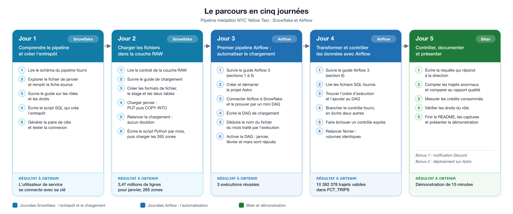

# Kit de démarrage — Pipeline médaillon NYC Yellow Taxi (Snowflake et Airflow)

Point de départ du brief. Ce kit contient ce qui est fourni ; tout le reste est à construire.

## Pour démarrer

1. Récupérer ce kit sur votre poste avec les commandes données dans les ressources du brief. Dans le dossier obtenu, lancer `git init`, puis le pousser dans un dépôt GitHub public à votre nom.
2. Vérifier le poste : `bash verifier_poste.sh`. Tout doit afficher `OK`.
3. Créer le compte d'essai Snowflake (édition Enterprise, région européenne) et noter l'identifiant de compte, de la forme `ORGANISATION-COMPTE`.
4. Regarder `docs/architecture.png` (ce que vous allez construire) et lire `CONTRAT_RAW.md`, puis suivre le brief journée par journée.


## Selon votre système

| Système | Terminal à utiliser | Installation d'Astro CLI | À savoir |
|---|---|---|---|
| macOS | Terminal | `brew install astro` | Docker Desktop ou OrbStack |
| Linux | terminal habituel | `curl -sSL install.astronomer.io \| sudo bash -s` | Docker Engine suffit |
| Windows | **WSL avec Ubuntu**, pas PowerShell | la commande Linux, dans Ubuntu | activer l'intégration WSL dans Docker Desktop ; cloner le dépôt dans le dossier personnel d'Ubuntu (`~`), pas sous `/mnt/c` : les droits des fichiers de clé n'y fonctionnent pas |

Toutes les commandes du brief et des guides (`openssl`, `awk`, `bash`, `python3`) sont celles d'un terminal macOS ou Linux. Sous Windows, elles s'exécutent telles quelles dans Ubuntu (WSL). Les consignes Windows n'ont pas été testées sur un poste réel.

## Contenu

```
.
├── CONTRAT_RAW.md                 noms et colonnes que votre entrepôt doit contenir
├── verifier_poste.sh              vérifie Python, Git, Docker, Astro CLI, OpenSSL
├── .gitignore                     exclut les clés, le .env et les fichiers téléchargés
├── snowflake/                     À ÉCRIRE : scripts d'infrastructure et de couche RAW
├── ingestion/                     À ÉCRIRE : script Python de chargement d'un mois
├── docs/
│   ├── architecture.png           FOURNI : le schéma du pipeline à construire
│   ├── parcours.png               FOURNI : les étapes des cinq journées
│   ├── ETAPES.md                  FOURNI : le détail de chaque étape, journée par journée
│   └── FICHE_SOURCE_MODELE.md     modèle de fiche source à copier et compléter
└── airflow/
    ├── requirements.txt           dépendances Python du projet Airflow
    ├── .env.example               format de la connexion Snowflake (à copier en .env, jamais versionné)
    ├── dags/                      À ÉCRIRE : votre DAG (créé par `astro dev init`)
    └── include/sql/               FOURNI : les fichiers SQL, à ne pas modifier
        ├── 00_tables.sql          crée les trois tables alimentées mois par mois
        ├── staging/               2 vues de renommage + les tables de codes
        ├── intermediate/          trajets étiquetés, puis trajets valides enrichis
        ├── marts/                 5 dimensions, la table de faits, 3 tables d'analyse
        └── controles/             1 contrôle FOURNI comme modèle, les autres À ÉCRIRE
```

## Le parcours en cinq journées



Le détail de chaque étape est dans [`docs/ETAPES.md`](docs/ETAPES.md).

## Où se fait chaque journée

| Jour | Dossier | Guide à suivre |
|---|---|---|
| 1 | `docs/`, `snowflake/` | Sécurité : rôles, droits et utilisateurs de service |
| 2 | `snowflake/`, `ingestion/` | Charger des fichiers : format, stage, PUT, COPY INTO |
| 3 | `airflow/dags/` | Airflow 3 avec Astro CLI, sections 1 à 5 |
| 4 | `airflow/dags/`, `airflow/include/sql/controles/` | Airflow 3 avec Astro CLI, section 6 |

Le contrôle fourni, `controles/raw_mois_charge.sql`, vérifie que le mois traité est bien présent dans RAW. Une requête de contrôle renvoie une seule ligne : si une de ses valeurs est fausse, la tâche échoue et la suite ne s'exécute pas. Écrivez les vôtres sur ce modèle.
| 5 | `README.md`, `docs/` | |

Les liens des guides sont dans le brief et dans ses ressources.

## Lire les fichiers SQL fournis

- Les noms sont complets (`NYC_TAXI.MARTS.FCT_TRIPS`) : la base, les schémas et les tables portent des noms imposés. Le nom du warehouse, du rôle et de l'utilisateur de service est libre.
- `{{ ds }}` est remplacé par Airflow par le premier jour du mois traité (`2025-01-01`). Exécuté tel quel dans Snowsight, le fichier échoue : remplacez d'abord `{{ ds }}` à la main pour le tester.
- `{{ params.xxx }}` est un paramètre à déclarer dans votre DAG :

| Paramètre | Valeur | Utilisé par |
|---|---|---|
| `max_trip_distance_miles` | `100` | `intermediate/int_trips__flagged.sql` |
| `max_trip_duration_min` | `180` | `intermediate/int_trips__flagged.sql` |
| `start_month` | `"2025-01-01"` | `marts/dim_date.sql` |
| `end_month` | `"2025-04-01"` | `marts/dim_date.sql` |

- Pour trouver l'ordre d'exécution : chaque fichier lit des tables (`FROM`, `JOIN`) et en crée une. Un fichier s'exécute après ceux qui créent les tables qu'il lit. `00_tables.sql` passe avant tout le reste.

## Mettre en place le projet Airflow (jour 3)

```bash
cd airflow
astro dev init                    # le dossier n'est pas vide : répondre y
```

`astro dev init` génère le `Dockerfile` et les fichiers du projet sans toucher à `requirements.txt` ni à `include/`. Supprimez ensuite `dags/exampledag.py`, créez `.env` à partir de `.env.example` (la clé privée y tient sur une seule ligne, voir le guide), puis :

```bash
astro dev start
```

L'adresse de l'interface est affichée à la fin de la commande. Un DAG est en pause à sa création : activez-le avec son interrupteur. N'utilisez pas le bouton Trigger : il lance une exécution datée d'aujourd'hui.

Quand vous ajoutez des tâches à un DAG dont les exécutions sont déjà terminées, elles ne tournent pas toutes seules : ouvrez chaque exécution et relancez-la avec Clear.

## Résultats attendus

| Table | Lignes après les trois mois |
|---|---|
| `RAW.YELLOW_TRIPDATA` | 11 198 026 (3 475 226 en janvier) |
| `RAW.TAXI_ZONE_LOOKUP` | 265 |
| `INTERMEDIATE.INT_TRIPS__FLAGGED` | 11 198 026 |
| `MARTS.FCT_TRIPS` | 10 382 378 |
| `MARTS.MART_ZONE_HOURLY_DEMAND` | 11 524 |
| `MARTS.MART_DATA_QUALITY` | 18 |
